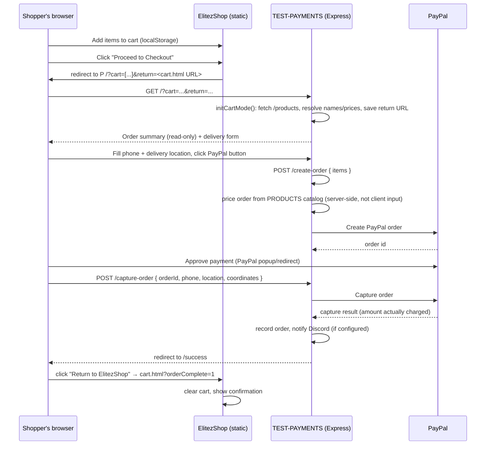

# Integration: ElitezShop ↔ TEST-PAYMENTS

Two independent repositories, deployed independently, connected by a single
browser redirect and a small JSON contract. There is no shared database, no
server-to-server API call, and no CORS/API-key coupling — the shop hands the
shopper's browser off to the payment service and gets it back.

```
┌───────────────────────┐                          ┌──────────────────────────┐
│   elitezshop           │                          │   TEST-PAYMENTS            │
│   (static frontend)      │   browser redirect →      │   (Node/Express + PayPal)   │
│   github.com/eliteprofast │ ────────────────────→   │   github.com/eliteprofast     │
│   /elitezshop               │ ←──────────────────────   │   /TEST-PAYMENTS                │
└───────────────────────┘                          └──────────────────────────┘
```

## Why a redirect, not an API call

The two apps are typically deployed on different origins (e.g. ElitezShop on
GitHub Pages/Netlify, TEST-PAYMENTS on Render) with no build tooling on the
frontend side. A full-page redirect avoids needing CORS configuration, API
keys, or a shared session — the cart data rides in the URL, and control comes
back the same way. This keeps ElitezShop a pure static site.

## Sequence



## Data contract

### Request: ElitezShop → TEST-PAYMENTS

A full-page navigation (not fetch/XHR) to:
```
{PAYMENT_SERVER_URL}/?cart=<url-encoded JSON>&return=<url-encoded URL>
```

- `cart` — URL-encoded JSON array: `[{ "id": "office-chair", "quantity": 2 }]`.
  `id` must match a key in the `PRODUCTS` catalog in `TEST-PAYMENTS/server.js`
  — TEST-PAYMENTS resolves the display name and price itself via `GET
  /products`; it never trusts a name or price passed in the URL.
- `return` — the ElitezShop URL to send the shopper back to after payment
  (normally the cart page's own URL). Validated as an absolute `http(s)` URL
  before use.

### Response: TEST-PAYMENTS → ElitezShop

On successful payment, the shopper is one click away (the "Return to
ElitezShop" link on `success.html`) from:
```
{return}?orderComplete=1
```
`elitezshop/cart-page.js`'s `handleOrderComplete()` treats `orderComplete=1`
as the signal to clear the cart and show a confirmation message. On payment
failure, `failed.html` links back to `{return}` unchanged — the cart is left
intact so the shopper can retry.

### Source of truth for pricing

The product catalog is intentionally duplicated in two places, each for a
different purpose:

| Location                                              | Purpose                                             |
|---------------------------------------------------------|------------------------------------------------------|
| `elitezshop/index.html` (`data-product-*` attributes)     | Display and cart bookkeeping only.                      |
| `TEST-PAYMENTS/server.js` (`PRODUCTS` constant)              | **Authoritative.** All pricing is computed from here.      |

Keeping ElitezShop's `data-product-id` values in sync with `PRODUCTS` keys is
a manual step today — adding a product means editing both files. If the
catalog grows, consider serving it from a single source (e.g. have ElitezShop
fetch `GET /products` at page load) rather than duplicating it.

### Currency conversion

`PRODUCTS` prices are AED (matching what ElitezShop displays), but PayPal
does not support AED as a checkout currency at all. TEST-PAYMENTS converts to
USD at order-creation time using a fixed peg (`AED_TO_USD_RATE = 3.6725` —
AED has been pegged to USD at this exact rate since 1997, so this is exact,
not an estimate), and the checkout page shows both the AED total and the USD
amount that will actually be charged. See TEST-PAYMENTS's README
[Currency](../README.md#currency-why-orders-charge-in-usd-not-aed) section
for details. Verified with a real sandbox capture: a 15.00 AED item charged
exactly $4.08 USD.

## Required configuration when deploying

1. Deploy TEST-PAYMENTS (e.g. to Render — see its README) and note its public
   URL.
2. In `elitezshop/cart.js`, set `PAYMENT_SERVER_URL` to that URL.
3. Deploy ElitezShop (e.g. to GitHub Pages/Netlify).
4. No configuration is needed on the TEST-PAYMENTS side for the return trip —
   the `return` URL is supplied dynamically by ElitezShop on every checkout,
   so TEST-PAYMENTS never needs to know ElitezShop's origin in advance.

## Known limitations

- **No shared order ID.** ElitezShop never learns the PayPal order id or
  capture result — it only learns "payment completed" via the
  `orderComplete=1` flag. There's no way for the shop to show order history
  or reconcile a specific order without extending the contract (e.g. passing
  the order id back in the return URL and querying `GET /orders`).
- **In-memory orders.** TEST-PAYMENTS' order records (including the ones tied
  to ElitezShop carts) are lost on restart — see its README's
  [Data storage](../README.md#data-storage) section.
- **Manual catalog sync.** See "Source of truth for pricing" above.
